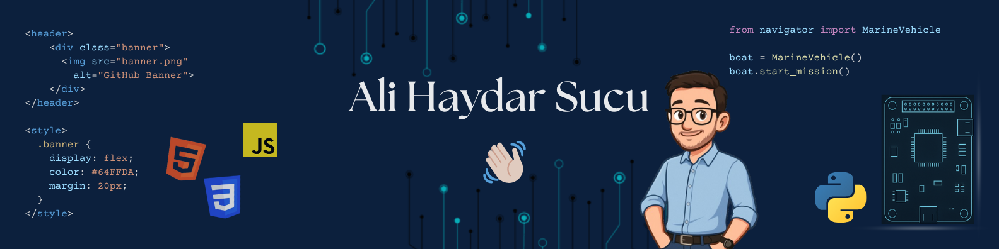

  
  

🌱 I'm **Ali Haydar Sucu**, a **Computer Engineering** student at **Ankara Yıldırım Beyazıt University**.  
🚀 Passionate about **web development** and **embedded software development**, currently working on **unmanned marine vehicle systems** and **local llms**.  
🐧 **Linux enthusiast** and open-source lover.

## Technologies & Tools 💻

  
  
  
  
  
  
  
  
  
  
  
  
  
  
  
  
  
  
  
  
  
  
  
  

## Statistics 📊

 
   
   

